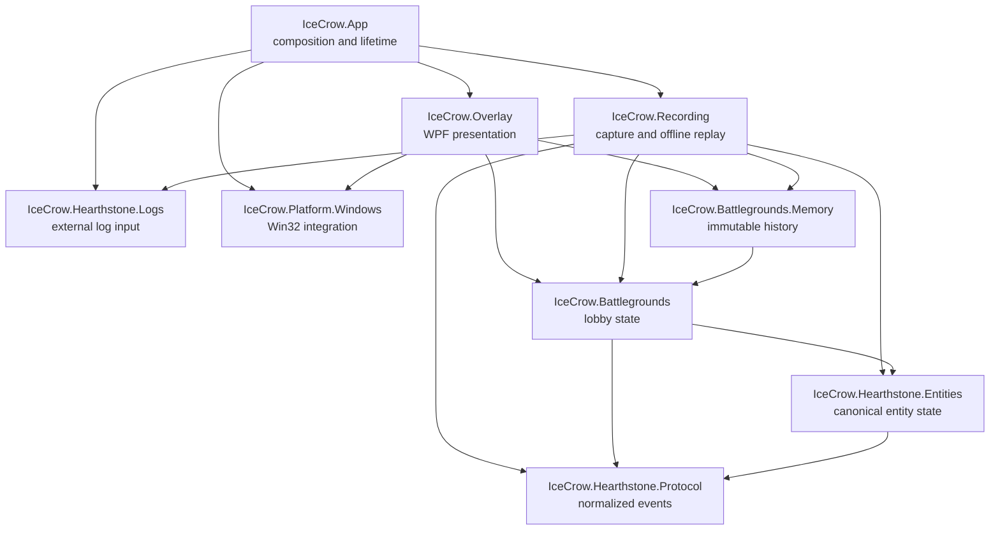

# IceCrow

IceCrow is a local-first Windows companion for Hearthstone Battlegrounds. It reads Hearthstone's `Power.log`, normalizes game events, reconstructs deterministic match state, remembers previously observed opponent boards, and renders a non-activating WPF overlay over the Hearthstone client.

> [!IMPORTANT]
> IceCrow is under active development and is **not production-ready**. The individual tracking modules and offline replay pipeline are implemented and tested, but the live `Power.log` → parser → reducers → Battlegrounds overlay composition is not connected in `IceCrow.App` yet. See the [v0.1 quality report](docs/v0.1-quality-report.md) for the current evidence and remaining gates.

## What exists today

- Hearthstone window discovery through `UnityWndClass` without depending on the English window title.
- Event-driven client-area tracking with WinEventHook, DPI conversion, minimize/restore handling, and HWND lifecycle validation.
- Borderless, transparent, no-activate WPF overlay that is click-through by default.
- Hold-ALT interactive overlay mode with a click-through fail-safe and no synthetic Hearthstone input.
- Incremental, asynchronous `Power.log` tailing with bounded backpressure, rotation/restart recovery, partial-line handling, and cancellation.
- Defensive Power protocol parser for the v0.1 event subset.
- Deterministic entity, Battlegrounds lobby, opponent memory, and lobby timeline reducers.
- Versioned, bounded match recording and offline replay with step/run-until/run-all support.
- Debug-only views for accepted log lines and Battlegrounds validation.

IceCrow does **not** automate gameplay, click Hearthstone controls, install global keyboard hooks, call an AI service, or require a backend.

## Architecture

The solution is split into small projects with an explicit dependency direction. Platform and presentation concerns remain outside the deterministic domain.



| Project | Responsibility | Allowed IceCrow dependencies |
| --- | --- | --- |
| `IceCrow.App` | WPF composition root and process lifetime | `Overlay`, `Platform.Windows`, `Hearthstone.Logs`, `Recording` |
| `IceCrow.Platform.Windows` | Win32 declarations, Hearthstone HWND discovery/tracking, input modifier state | None |
| `IceCrow.Overlay` | Overlay windows and presentation state | `Battlegrounds`, `Battlegrounds.Memory`, `Platform.Windows` |
| `IceCrow.Hearthstone.Logs` | `log.config` management and bounded raw log input | None |
| `IceCrow.Hearthstone.Protocol` | Defensive parsing into normalized game events | None |
| `IceCrow.Hearthstone.Entities` | Canonical mutable match entities and immutable snapshots | `Hearthstone.Protocol` |
| `IceCrow.Battlegrounds` | Deterministic Battlegrounds state reduction | `Hearthstone.Entities`, `Hearthstone.Protocol` |
| `IceCrow.Battlegrounds.Memory` | Immutable opponent boards and lobby timelines | `Battlegrounds` |
| `IceCrow.Recording` | Versioned capture and deterministic offline replay | Domain/log projects only; no WPF or HWND |

Architecture tests enforce this graph, reject cycles, prevent WPF/Win32 APIs from entering domain projects, and limit every ordinary test project to one direct production-project dependency.

## Data flow

The intended live pipeline is:

```text
Power.log
  -> RawLogLine
  -> PowerLineParser
  -> normalized GameEvent
  -> EntityStore
  -> BattlegroundsReducer
  -> OpponentMemory / LobbyTimeline
  -> immutable overlay view state
```

The same normalized events can be serialized and replayed without Hearthstone, HWNDs, WPF, network access, or real-time delays. This is the main regression path while live composition is still incomplete.

## Requirements

- Windows 10 or Windows 11.
- [.NET SDK 10.0.302](https://dotnet.microsoft.com/download/dotnet/10.0) or a compatible SDK selected by `global.json`.
- Hearthstone is required only for live window/log validation. Unit tests and replay tests run without it.

No administrator privileges are required; the app manifest uses `asInvoker`.

## Build and test

From the repository root:

```powershell
dotnet restore IceCrow.sln
dotnet build IceCrow.sln --no-restore
dotnet test IceCrow.sln --no-build --no-restore
```

The complete quality gate also checks Release and repository formatting:

```powershell
dotnet build IceCrow.sln -c Release --no-restore
dotnet test IceCrow.sln -c Release --no-build --no-restore
dotnet format IceCrow.sln --verify-no-changes --no-restore
```

To start the current development application:

```powershell
dotnet run --project src/IceCrow.App/IceCrow.App.csproj
```

On startup, IceCrow may update Hearthstone's `log.config` to enable Power logging while preserving unrelated settings. Hearthstone may need to be restarted for a changed log configuration to take effect. Do not perform that restart during an active match.

## Design rules

- Treat `Power.log` and replay files as untrusted input.
- Keep all external queues, strings, event counts, histories, and replay work bounded.
- Keep domain projects independent from WPF, Win32, HWNDs, files, and network services unless the project responsibility explicitly owns that boundary.
- Preserve normalized events between parsing and state reduction.
- Keep historical snapshots immutable; never retain mutable `GameEntity` instances in history.
- Keep undocumented numeric Battlegrounds tags in one compatibility type with provenance comments.
- Unknown Hearthstone events must not crash the tracker.
- The overlay must fail safe to click-through and must never synthesize gameplay input.

The full contributor constraints are documented in [AGENTS.md](AGENTS.md).

## Clean-room notice

The local Hearthstone Deck Tracker checkout referenced during development is behavioral research material only. IceCrow does not port HDT's `User32.cs`, copy its overlay window, or reproduce its legacy parser architecture. Implementations are deliberately small and IceCrow-owned; primary platform documentation is preferred for public Win32/.NET contracts.

Hearthstone and Battlegrounds are trademarks of Blizzard Entertainment. IceCrow is an independent community project and is not affiliated with or endorsed by Blizzard Entertainment or HearthSim/Hearthstone Deck Tracker.

## Roadmap

The immediate priorities are intentionally engineering-focused:

1. Connect the complete live log-to-overlay composition pipeline.
2. Run the real Hearthstone acceptance matrix, including mixed-DPI, move/resize, minimize/restore, click-through, ALT interaction, focus, restart, and log rotation.
3. Add GitHub Actions for Debug/Release build, tests, and formatting.
4. Grow a minimized corpus of real, anonymized replay regressions.
5. Add parser/replay fuzzing and long-duration resource-usage tests.

Strategy recommendations, simulation, backend services, and card-art infrastructure are outside the current milestone.

## License

IceCrow is licensed under the [GNU General Public License v3.0](LICENSE).
