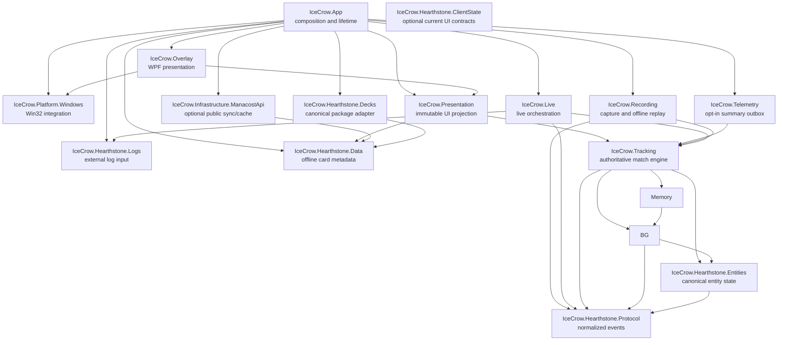

# IceCrow

[](https://github.com/Manacost-Labs/IceCrow/actions/workflows/ci.yml)

IceCrow is a local-first Windows companion for Hearthstone Battlegrounds. It reads Hearthstone's `Power.log`, normalizes game events, reconstructs deterministic match state, remembers previously observed opponent boards, and renders a non-activating WPF overlay over the Hearthstone client.

> [!IMPORTANT]
> IceCrow is under active development and is **not production-ready**. The live `Power.log` → parser → deterministic tracking → overlay composition is implemented and covered by synthetic integration tests, but the real-client acceptance matrix has not yet been executed. See the [v0.1 quality report](docs/v0.1-quality-report.md) and [live acceptance checklist](docs/live-acceptance-checklist.md) for the current evidence and remaining gates.

## What exists today

Parser/replay hardening, explicit live-state limits, deterministic soak tests,
and diagnostic performance baselines are documented in the
[M15 hardening report](docs/hardening-report.md).

- Hearthstone window discovery through `UnityWndClass` without depending on the English window title.
- Event-driven client-area tracking with WinEventHook, DPI conversion, minimize/restore handling, and HWND lifecycle validation.
- Borderless, transparent, no-activate WPF overlay that is click-through by default.
- Hold-ALT interactive overlay mode with a click-through fail-safe and no synthetic Hearthstone input.
- Incremental, asynchronous `Power.log` tailing with bounded backpressure, rotation/restart recovery, partial-line handling, and cancellation.
- Defensive Power protocol parser for the v0.1 event subset.
- One authoritative `TrackingSession` for normalized event processing across live tracking, replay, and integration tests.
- Non-WPF live coordination with bounded pre-detection buffering, conservative Battlegrounds lifecycle evidence, and bounded developer diagnostics.
- Deterministic entity, Battlegrounds lobby, opponent memory, and lobby timeline reducers.
- Versioned, bounded match recording and offline replay with step/run-until/run-all support.
- A dev-only fixture importer with deterministic anonymization, compact golden expectations, and normalized/raw corpus runners.
- Debug-only views for accepted log lines and Battlegrounds validation.
- Offline-first Manacost card/Battlegrounds metadata with CardId/DBF lookups,
  a hash-validated last-known-good cache, and background public API refresh.
- `ManacostLabs.Deckstrings` 1.0.0 behind IceCrow-owned deck models for offline
  encode/decode/validation, sideboards, and clipboard exports.
- Consent-off-by-default derived match summaries and a bounded local telemetry
  outbox; no raw logs and no upload transport are enabled.

IceCrow does **not** automate gameplay, click Hearthstone controls, install global keyboard hooks, call an AI service, contain a shared Manacost token, or require a backend.

## Architecture

The solution is split into small projects with an explicit dependency direction. Platform and presentation concerns remain outside the deterministic domain.



| Project | Responsibility | Allowed IceCrow dependencies |
| --- | --- | --- |
| `IceCrow.App` | WPF composition root and process lifetime | UI/platform, optional data, decks, telemetry, live, and recording boundaries |
| `IceCrow.Platform.Windows` | Win32 declarations, Hearthstone HWND discovery/tracking, input modifier state | None |
| `IceCrow.Overlay` | WPF overlay windows, interaction, and native-window hosting | `Presentation`, `Platform.Windows` |
| `IceCrow.Presentation` | WPF-free immutable projection from tracking snapshots and local metadata to UI values | `Hearthstone.Data`, `Tracking` |
| `IceCrow.Hearthstone.Logs` | `log.config` management and bounded raw log input | None |
| `IceCrow.Hearthstone.Protocol` | Defensive parsing into normalized game events | None |
| `IceCrow.Hearthstone.ClientState` | Optional immutable current-client contracts and semantic change detection; no HearthMirror dependency | None |
| `IceCrow.Hearthstone.Data` | IceCrow-owned static card/hero contracts, CardId/DBF indexes, and local BG filters | None |
| `IceCrow.Hearthstone.Decks` | IceCrow deck models and `ManacostLabs.Deckstrings` adapter | `Hearthstone.Data` |
| `IceCrow.Hearthstone.Entities` | Canonical mutable match entities and immutable snapshots | `Hearthstone.Protocol` |
| `IceCrow.Battlegrounds` | Deterministic Battlegrounds state reduction | `Hearthstone.Entities`, `Hearthstone.Protocol` |
| `IceCrow.Battlegrounds.Memory` | Immutable opponent boards and lobby timelines | `Battlegrounds` |
| `IceCrow.Tracking` | Authoritative event-to-state orchestration shared by live, replay, and integration paths | `Hearthstone.Protocol`, `Hearthstone.Entities`, `Battlegrounds`, `Battlegrounds.Memory` |
| `IceCrow.Live` | Background parsing, conservative BG lifecycle detection, and live coordination | `Hearthstone.Logs`, `Hearthstone.Protocol`, `Tracking`; no WPF/Win32 |
| `IceCrow.Recording` | Versioned capture, replay navigation, and replay-specific resource budgets | `Tracking` and its typed domain contracts; no WPF, HWND, or log input |
| `IceCrow.Infrastructure.ManacostApi` | Optional public HTTPS synchronization, atomic data cache, and bounded image cache | `Hearthstone.Data` |
| `IceCrow.Telemetry` | Consent-aware match summaries and bounded persistent outbox | `Tracking` |

Architecture tests enforce this graph, reject cycles, prevent WPF/Win32 APIs from entering portable projects, keep developer tools out of runtime dependencies, require bounded channels, and limit every ordinary test project to one direct production-project dependency. The maintained design is in [architecture.md](docs/architecture.md); new work starts with the [feature development guide](docs/feature-development.md), [module boundaries](docs/module-boundaries.md), and [error model](docs/error-model.md).

Client state is intentionally separate from the tracking engine. Power.log and
`TrackingSession` remain authoritative for match history; optional client-state
providers may only enrich current presentation such as a hovered opponent or a
visible choice UI. The current tree does not bundle HearthMirror because its
independent licensing and redistribution terms are not published. See
[`docs/hearthmirror-research.md`](docs/hearthmirror-research.md) and
[`docs/client-state-authority.md`](docs/client-state-authority.md).

`tools/IceCrow.FixtureTool` is deliberately outside the runtime graph. It
depends on `Recording` and `Live` only to validate/anonymize candidate fixtures
and run both golden paths; no runtime project references the tool.

## Data flow

The live pipeline is:

```text
Power.log
  -> RawLogLine
  -> PowerLineParser
  -> normalized GameEvent
  -> BattlegroundsLifecycleDetector
  -> TrackingSession
       -> EntityStore
       -> BattlegroundsReducer
       -> OpponentMemory / LobbyTimeline
  -> immutable TrackingSnapshot
  -> WPF-free BattlegroundsOverlayViewState
  -> latest-only WPF Dispatcher presentation
  -> OverlayHost.ApplyViewState
```

The same `TrackingSession` consumes normalized events during live processing, direct integration tests, and offline replay. Replays run without Hearthstone, HWNDs, WPF, network access, or real-time delays. Unknown and malformed records update bounded diagnostics but never enter the tracking engine.

Static enrichment follows an independent path:

```text
public Manacost API -> bounded background download -> validated temporary snapshot
  -> atomic last-known-good cache -> ICardDatabase -> presentation mapping
```

Startup and match tracking do not wait for this path. See the
[data authority](docs/data-authority.md), [API contract](docs/manacost-api-contract.md),
and [cache design](docs/local-data-cache.md).

## Requirements

- Windows 10 or Windows 11.
- [.NET SDK 10.0.302](https://dotnet.microsoft.com/download/dotnet/10.0) or a compatible SDK selected by `global.json`.
- Hearthstone is required only for live window/log validation. Unit tests and replay tests run without it.

No administrator privileges are required; the app manifest uses `asInvoker`.

## Build and test

From the repository root:

```powershell
dotnet restore IceCrow.sln
dotnet build IceCrow.sln --no-restore
dotnet test IceCrow.sln --no-build --no-restore --filter "Category!=Soak"
```

The complete quality gate also checks Release and repository formatting:

```powershell
dotnet build IceCrow.sln -c Release --no-restore
dotnet test IceCrow.sln -c Release --no-build --no-restore --filter "Category!=Soak"
dotnet format IceCrow.sln --verify-no-changes --no-restore
```

Long deterministic lifetime tests are deliberately separate from pull-request
CI. Run them locally with `--filter "Category=Soak"`, or start the manual
GitHub Actions workflow with `run_soak` enabled. The repeatable, non-gating
performance command is listed in the [hardening report](docs/hardening-report.md).

The same Debug/Release quality gate runs on `windows-latest` for every pull request and every push to `main`. Failed test runs retain TRX results for seven days. The badge reports only the published `main` workflow; it is not a production-readiness claim.

To start the current development application:

```powershell
dotnet run --project src/IceCrow.App/IceCrow.App.csproj
```

To validate the committed Battlegrounds corpus or import a private captured
recording, use the dev-only fixture tool. It writes a new candidate directory,
never commits it, and refuses to overwrite an existing candidate:

```powershell
dotnet run --project tools/IceCrow.FixtureTool/IceCrow.FixtureTool.csproj -- `
  validate --fixture tests\fixtures\battlegrounds\synthetic-basic-solo
```

The complete capture, privacy-review, minimization, and golden-test process is
documented in the [regression workflow](docs/regression-workflow.md). Current
committed corpus entries are synthetic infrastructure tests; they do not prove
real-client behavior.

On startup, IceCrow may update Hearthstone's `log.config` to enable Power logging while preserving unrelated settings. Hearthstone may need to be restarted for a changed log configuration to take effect. Do not perform that restart during an active match.

## Design rules

- Treat `Power.log` and replay files as untrusted input.
- Keep all external queues, strings, event counts, histories, and replay work bounded.
- Keep domain projects independent from WPF, Win32, HWNDs, files, and network services unless the project responsibility explicitly owns that boundary.
- Preserve normalized events between parsing and state reduction.
- Keep historical snapshots immutable; never retain mutable `GameEntity` instances in history.
- Keep undocumented numeric Battlegrounds tags in one compatibility type with provenance comments.
- Unknown Hearthstone events must not crash the tracker.
- The overlay must fail safe to click-through and must never synthesize gameplay input.

The full contributor constraints are documented in [AGENTS.md](AGENTS.md).
Runtime ownership, budgets, dependencies, and measurement commands are recorded
in [threading-model.md](docs/threading-model.md),
[resource-budgets.md](docs/resource-budgets.md),
[dependencies.md](docs/dependencies.md), and
[performance.md](docs/performance.md).

## Clean-room notice

The local Hearthstone Deck Tracker checkout referenced during development is behavioral research material only. IceCrow does not port HDT's `User32.cs`, copy its overlay window, or reproduce its legacy parser architecture. Implementations are deliberately small and IceCrow-owned; primary platform documentation is preferred for public Win32/.NET contracts.

Hearthstone and Battlegrounds are trademarks of Blizzard Entertainment. IceCrow is an independent community project and is not affiliated with or endorsed by Blizzard Entertainment or HearthSim/Hearthstone Deck Tracker.

## Roadmap

The immediate priorities are intentionally engineering-focused:

1. Run the real Hearthstone acceptance matrix, including lifecycle/reconnect behavior, mixed-DPI, move/resize, minimize/restore, click-through, ALT interaction, focus, restart, and log rotation.
2. Run and stabilize the first remote GitHub Actions quality gate, then require it through branch protection.
3. Grow a minimized corpus of real, anonymized replay regressions.
4. Calibrate the new live warning/hard limits against anonymized real-match recordings.
5. Replace the conservative Power.log-only Battlegrounds mode fallback if a stronger supported client signal becomes available.

Strategy recommendations, simulation, telemetry server authentication/ingest,
and a complete card-art UI are outside the current milestone.

## License

IceCrow is licensed under the [GNU General Public License v3.0](LICENSE).
