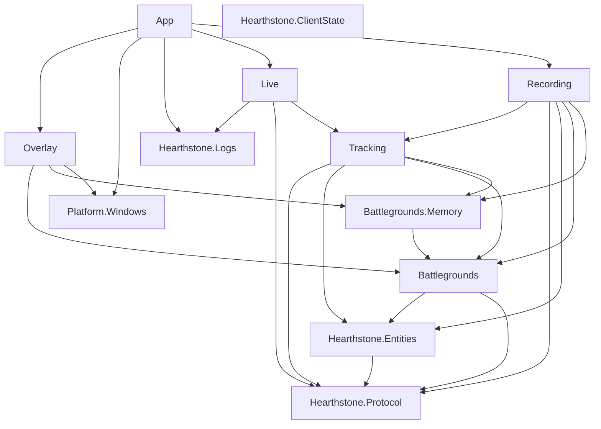

# IceCrow architecture audit

Date: 2026-08-14

This document records the architecture observed at commit `8d47587` before the
modularity changes in this milestone. It is intentionally an audit, not the
canonical target architecture; the maintained architecture is documented in
[`architecture.md`](architecture.md).

## Baseline

- Branch: `main`, clean and equal to `origin/main`.
- Production assemblies: 12.
- Developer tools: one (`IceCrow.FixtureTool`).
- Debug restore/build: passed with zero warnings and zero errors.
- Debug tests: 168 passed.
- Recent architecture commits: `dfe732b` introduced the first dependency
  guards; `8d47587` introduced the shared tracking/live engine, fixture tooling,
  hard limits, CI, and the independent ClientState contracts.

## Current project graph

The arrows point from a project to its direct IceCrow dependency.



The graph is acyclic. `Platform.Windows`, `Hearthstone.Logs`,
`Hearthstone.Protocol`, and `Hearthstone.ClientState` are leaves. The noteworthy
coupling is `Overlay -> Battlegrounds + Battlegrounds.Memory`: the WPF assembly
builds domain-derived opponent rows itself instead of receiving an immutable
presentation model.

## Current data flows

### Live game

```text
Power.log
  -> PowerLogTailer / RawLogLine
  -> PowerLineParser / protocol GameEvent
  -> BattlegroundsLifecycleDetector
  -> TrackingSession
       -> EntityStore
       -> BattlegroundsReducer
       -> OpponentMemoryService
       -> LobbyTimeline
  -> TrackingSnapshot
  -> LiveOverlayPresenter
  -> OverlayWindow
```

### Replay

```text
recording JSON
  -> RecordingSerializer / RecordedMatch
  -> ReplayRunner
  -> the same TrackingSession used by live tracking
  -> ReplayState / TrackingSnapshot projections
```

Replay owns navigation and untrusted-file work budgets, not a second game-state
implementation.

### Client state

```text
IClientStateProvider
  -> ClientStateCoordinator
  -> immutable ClientStateSnapshot / ClientStateChange
  -> future presentation enrichment
```

There is no bundled provider adapter. Client state is not connected to
`TrackingSession` and cannot rewrite historical truth.

### Overlay

```text
TrackingSnapshot
  -> App.LiveOverlayPresenter
  -> OverlayHost.ApplyBattlegroundsState
  -> OverlayWindow.ApplyBattlegroundsState
  -> OpponentLobbyTileViewState.Create
  -> WPF controls
```

The final mapping step is pure, but it currently lives inside the WPF assembly
and requires direct domain references. This is the principal evidence-backed
boundary change selected by this audit.

## State ownership

| State | Single owner | Notes |
| --- | --- | --- |
| Active log path and byte offset | `PowerLogTailer` | `LogReadCheckpoint` is an immutable observation of tailer state. |
| Parser entity/block context and diagnostics counters | `PowerParserContext` | Never shared with reducers. |
| Mutable Hearthstone entities and tags | `TrackingSession` through its private `EntityStore` | `EntityStore` is the write model; consumers receive snapshots. |
| Match lifecycle and authoritative revision | `TrackingSession` | Live and replay invoke the same methods. |
| Battlegrounds historical state | `TrackingSession` through `BattlegroundsReducer` | Reducer is pure; session owns the current value. |
| Opponent board history | `TrackingSession` through `OpponentMemoryService` | Historical snapshots are immutable. |
| Lobby timeline | `TrackingSession` through `LobbyTimeline` | Mutable builder is private to the session. |
| Live pre-detection buffer and ingestion counters | `LiveTrackingCoordinator` | These are live-source concerns, not historical truth. |
| Replay cursor and replay work budgets | `ReplayRunner` | Reconstructed state remains owned by its `TrackingSession`. |
| Current hover/choice/mode enrichment | `ClientStateCoordinator` and its provider | Supplemental and non-authoritative. |
| Hearthstone HWND and client geometry | `Platform.Windows` | `OverlayHost` owns only connection/lifetime coordination. |
| Overlay visibility and interaction mode | `OverlayHost` / `OverlayWindow` | Native failures return to click-through. |
| WPF control state | `OverlayWindow` | Pinned/hovered panel selection is presentation-local. |
| Application object lifetime | `App` | It wires and disposes components; it owns no game rules. |

No ambiguous state owner was found. Presentation composition is misplaced by
assembly, but not multiply owned.

## Project-boundary review

| Project | Why it is an assembly | Merge/split assessment |
| --- | --- | --- |
| `IceCrow.App` | Windows/WPF composition root and process lifetime. | Keep. A DI framework or separate runtime coordinator is not justified by the current object graph. |
| `IceCrow.Platform.Windows` | Quarantines Win32 declarations, hooks, HWNDs, and modifier polling. | Keep as a hard native boundary. |
| `IceCrow.Overlay` | Quarantines WPF window lifetime, rendering, hit testing, and click-through safety. | Keep, but remove domain-to-view mapping from this assembly. |
| `IceCrow.Hearthstone.Logs` | Owns local filesystem discovery, `log.config`, watching, and raw-log backpressure. | Keep separate from protocol parsing. |
| `IceCrow.Hearthstone.Protocol` | Converts an untrusted external text protocol into immutable normalized events. | Keep as the lowest shared Hearthstone contract. |
| `IceCrow.Hearthstone.ClientState` | Stable IceCrow-owned contracts for optional current-client providers. | Keep independent; adapters must be separate licensed integration assemblies. |
| `IceCrow.Hearthstone.Entities` | Generic Hearthstone entity write model and immutable entity snapshots. | Keep; it is shared by mode reducers and should not acquire BG rules. |
| `IceCrow.Battlegrounds` | Battlegrounds-specific reducer and lobby semantics. | Keep; do not generalize into a mode framework yet. |
| `IceCrow.Battlegrounds.Memory` | Historical BG boards/timeline are a feature-domain boundary used by tracking, replay, and presentation. | Keep. Merging into `Tracking` would hide reusable immutable contracts; splitting it further would add no useful boundary. |
| `IceCrow.Tracking` | Authoritative deterministic orchestration shared by live and replay. | Keep. It may coordinate current BG reducers, but future features must consume its updates/snapshots rather than be added internally. |
| `IceCrow.Live` | Owns live-only parsing, lifecycle evidence, buffering, and diagnostics. | Keep. It must not acquire WPF or replay semantics. |
| `IceCrow.Recording` | Owns serialization, replay navigation, and replay-specific trust budgets. | Keep as infrastructure around `TrackingSession`, not a second engine. |

One new assembly is justified: a small WPF-independent presentation-model
boundary that depends on `Tracking`, while `Overlay` depends only on that model
and `Platform.Windows`. This removes a real dependency edge and gives pure
mapping tests a stable home.

## Central-type assessment

| Type | Current responsibilities | Decision |
| --- | --- | --- |
| `TrackingSession` | Owns entity state, BG reduction, opponent capture, timeline, match lifecycle, limits, and immutable output. | Keep together: these operations form one atomic deterministic revision. Treat `TrackingUpdate` and `TrackingSnapshot` as the extension boundary; do not add future analysis engines here. |
| `LiveTrackingCoordinator` | Parses raw lines, detects BG lifecycle, buffers pre-start events, applies tracking, publishes material changes, and exposes live diagnostics. | Keep together for single-consumer ordering. Diagnostics should remain cheap and bounded; feature/domain interpretation must not move here. |
| `BattlegroundsReducer` | Pure BG state transitions from observed immutable entities/mutations. | Keep as one reducer; its size reflects a cohesive state transition table. |
| `EntityStore` | Mutable entity/tag write model, limits, queries, and immutable snapshot creation. | Keep. Cache hot diagnostic aggregates rather than scanning the entire store per line. |
| `PowerLineParser` | Dispatches the supported Power grammar and manages parser context. | Keep the façade; patterns and context are already separate. Splitting handlers now would add navigation without a dependency boundary. |
| `PowerLogTailer` | Watches/discovers, incrementally reads, frames/filter lines, checkpoints, and publishes to a bounded channel. | Keep as the filesystem input boundary. Rotation/generation detection remains technical debt, not an architecture split. |
| `ReplayRunner` | Replay cursor, lifecycle dispatch into `TrackingSession`, and untrusted-input work budgets. | Keep; it delegates all state semantics to tracking. |
| `OverlayHost` | Hearthstone-window connection, timers, interaction fail-safe, and WPF-window lifetime. | Keep. Replace domain arguments with a presentation-ready view state. |
| `OverlayWindow` | WPF rendering, hit testing, hover/pin/settings UI, and native no-activate/click-through handling. | Keep code-behind for UI mechanics; remove game-state interpretation. |
| `ClientStateCoordinator` | Serial provider reads, failure containment, semantic change detection, polling, cancellation, and disposal. | Keep; it is a cohesive adapter contract coordinator. |
| `App` | Builds the object graph, starts the pipeline, forwards outputs, and disposes it. | Keep as composition root. It contains no GameTag or reducer rules; `ApplicationRuntime` and DI are premature. |

## Concrete architecture risks

1. **WPF assembly interprets domain state.** `OverlayWindow` and
   `OpponentLobbyTileViewState.Create` consume BG state, opponent memory, and
   timeline directly. Future overlay features would pull more domain types into
   WPF unless a presentation-model boundary is enforced.
2. **TrackingSession can become the feature registry.** It is correctly the
   authoritative engine, but future analysis/statistics code could be added to
   `Apply`. The existing immutable `TrackingUpdate`/`TrackingSnapshot` outputs
   must be declared as extension contracts.
3. **Live orchestration can accumulate policy and hot-path work.** It currently
   computes diagnostics for every raw line. `EntityStore.MaximumTagCount` scans
   all entities on each read, so the metric should be maintained by the state
   owner instead of recomputed in the live layer.
4. **Public does not mean supported external API.** Cross-assembly DTOs must be
   public, but reducers, mutable stores, and compatibility types are internal
   implementation contracts and should not be promised as a plugin ABI.
5. **Future Standard mode could be falsely generalized.** `Protocol` and
   `Entities` are generic; `TrackingSession`, lifecycle detection, memory, and
   current snapshots are explicitly BG-focused. A generic mode framework has no
   second implementation today and is rejected.
6. **Architecture tests mostly freeze the current graph.** They need explicit
   guards for runtime-to-tool references, deterministic-core filesystem access,
   native interop placement, and the new presentation boundary.

## Selected changes

- Add one WPF-independent `IceCrow.Presentation` assembly and tests.
- Move opponent/lobby view-state construction out of `IceCrow.Overlay`.
- Make `OverlayHost`/`OverlayWindow` accept presentation-ready immutable state.
- Expand project and source-level architecture guards.
- Cache `EntityStore.MaximumTagCount` in the mutation owner to remove existing
  per-line O(entity-count) diagnostic work without adding allocations.
- Add canonical architecture, extension, error-boundary, and four concise ADR
  documents.

## Changes considered but rejected

- **Generic game-mode engine:** no second mode exists; it would hide BG-specific
  lifecycle assumptions behind speculative abstractions.
- **`ITrackingState` / `ITrackingSnapshot`:** all real consumers need the same
  immutable records. An interface would not currently remove a dependency.
- **Application runtime or DI container:** `App` is 189 lines and only wires a
  small deterministic object graph. Moving the same code would not reduce
  coupling.
- **Event bus or mediator:** live and replay require explicit ordered calls;
  indirect dispatch would complicate determinism and allocation analysis.
- **Merge `Battlegrounds.Memory` into Tracking:** historical BG contracts have
  independent consumers and a coherent feature-domain responsibility.
- **Split parser/tailer/replay by line count:** each type owns one cohesive
  boundary; no useful dependency edge would be created.
- **Plugin loader or backend client:** ABI, sandboxing, versioning, credentials,
  and distribution policy are not current requirements.

## Implemented outcome

The audit led to one new production boundary: `IceCrow.Presentation`. It depends
on `Tracking`, owns the immutable tracking-to-overlay projection, and is the only
domain-facing dependency of `Overlay`. `OpponentLobbyTileViewState` was removed
from the WPF assembly; no existing production project was merged or removed.

The exact dependency graph, native placement, HearthMirror isolation,
runtime/tool separation, and one-direct-module test rule are executable
architecture tests. `EntityStore` now maintains its maximum per-entity tag count
at mutation time, removing the prior full-store scan from per-line diagnostics.
