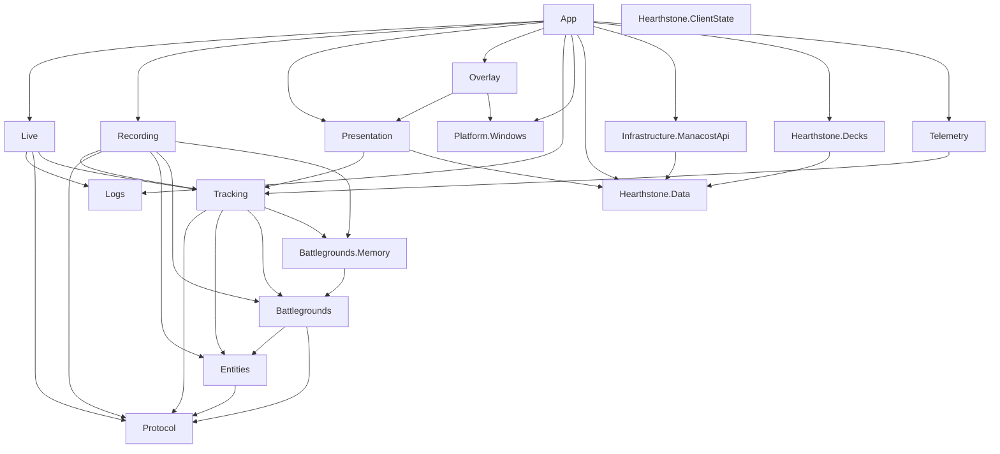

# IceCrow architecture

This is the canonical description of the current architecture. IceCrow is a
local-first Windows tracker: deterministic match reconstruction must work
without WPF, a Hearthstone window, network access, or a backend.

## Dependency direction



The graph is directed and acyclic. `Protocol`, `Logs`, `Platform.Windows`,
`ClientState`, and `Hearthstone.Data` are boundary leaves. Domain projects
never depend on WPF, Win32, or HTTP. `Overlay` receives presentation-ready
immutable values and therefore does not interpret game state.

## Layer responsibilities

| Layer | Projects | Responsibility |
| --- | --- | --- |
| External input | `Hearthstone.Logs`, `Hearthstone.Protocol`, `Hearthstone.ClientState` | Bound, validate, and normalize untrusted external observations. |
| Deterministic state | `Hearthstone.Entities`, `Battlegrounds`, `Battlegrounds.Memory`, `Tracking` | Own canonical match state and immutable historical snapshots. |
| Infrastructure | `Live`, `Recording`, `Platform.Windows` | Orchestrate live input, replay files, and native Windows integration. |
| Optional data infrastructure | `Infrastructure.ManacostApi` | Public HTTPS sync, last-known-good snapshots, and image disk cache; never required for tracking. |
| Static/deck/telemetry contracts | `Hearthstone.Data`, `Hearthstone.Decks`, `Telemetry` | Offline metadata, canonical package adaptation, and consent-aware derived summaries. |
| Presentation | `Presentation`, `Overlay` | Map tracking snapshots into UI values, then render them with WPF. `Presentation` also owns platform-neutral layout breakpoints and rendering policy; `Overlay` owns the design tokens and component library (`docs/design-system.md`). |
| Composition | `App` | Construct, start, connect, and dispose the process object graph. |
| Developer tooling | `tools/IceCrow.FixtureTool` | Import and verify fixtures; never part of the runtime graph. |

Every production assembly represents either a trust boundary, a reusable
deterministic domain, or a platform/presentation boundary. A new assembly must
remove a real dependency edge or protect a distinct trust boundary.

Inside `IceCrow.App`, `App.xaml.cs` owns only WPF startup/exit and diagnostics.
Concrete runtime coordinators own data refresh, live ingestion, local telemetry,
and overlay presentation. This is a folder-level composition split, not another
assembly or a service-locator abstraction.

## Authoritative state and extension boundary

`TrackingSession` is the single writer for a match revision. It owns the
`EntityStore`, current `BattlegroundsState`, opponent memory, lobby timeline,
and lifecycle timestamps. Live tracking and replay both submit normalized
`GameEvent` values to this same engine.

Consumers extend IceCrow from immutable `TrackingUpdate` and
`TrackingSnapshot` outputs. Feature-specific analysis, statistics, export, and
presentation mapping must consume those outputs; they must not be inserted
into `TrackingSession.Apply` unless they are required to make the authoritative
state transition atomic and deterministic.

`Protocol` and `Entities` are game-mode neutral. Current lifecycle detection,
tracking output, and opponent memory are Battlegrounds-specific. A generic game
mode framework will be introduced only after a second real mode demonstrates a
shared contract.

## Main flows

```text
Live:   Power.log -> Logs -> Protocol -> Live lifecycle -> TrackingSession
Replay: JSON recording -> Recording -> TrackingSession
UI:     TrackingSnapshot -> Presentation factory -> Overlay -> WPF
Client: provider -> ClientStateCoordinator -> supplemental current-UI snapshot
```

Client state may enrich current UI, but it cannot create or rewrite historical
match state. Replay remains independent from live files, HWNDs, WPF, delays,
and network access.

## State ownership

| State | Owner |
| --- | --- |
| Log generation, path, and byte offset | `PowerLogTailer` |
| Parser block/entity context | `PowerParserContext` |
| Match lifecycle, entities, BG state, history, revision | `TrackingSession` |
| Live pre-detection buffer and ingestion diagnostics | `LiveTrackingCoordinator` |
| Replay cursor and replay work budget | `ReplayRunner` |
| Current client-state observation | `ClientStateCoordinator` |
| HWND, native hooks, client geometry | `Platform.Windows` |
| Overlay connection/interaction and WPF controls | `OverlayHost` / `OverlayWindow` |
| Process object lifetime | `App` and concrete `App/Runtime` coordinators |

Historical snapshots and presentation view states copy caller-owned
collections. Mutable `GameEntity` instances never escape into history.

## Contracts and compatibility

Public records used between IceCrow assemblies are internal product contracts,
not a stable third-party plugin ABI. The most stable seams are normalized
protocol events and immutable tracking snapshots. Replay envelopes are
explicitly versioned. Compatibility GameTags are centralized and require a
source/provenance comment. Mutable reducers, stores, diagnostics, and WPF types
may evolve between development releases.

| Type | Role | Stability |
| --- | --- | --- |
| `GameEvent` hierarchy | cross-module normalized protocol contract | additive evolution; never serialized with runtime type metadata |
| `EntitySnapshot` | cross-module immutable engine contract | additive while internal to IceCrow releases |
| `TrackingUpdate` / `TrackingSnapshot` | primary feature-consumer contract | preferred long-lived extension seam |
| `BoardSnapshot` / timeline snapshots | immutable feature-domain history | cross-module, not a third-party ABI |
| `ClientStateSnapshot` | optional current-UI enrichment contract | provider-neutral cross-module contract |
| recording DTOs | versioned serialization format | governed by `formatVersion` and explicit discriminators |
| overlay view states | immutable presentation contract | may change with IceCrow UI requirements |
| stores, reducers, parser context | implementation | not an extension contract |

No plugin loader or required tracking backend exists today. Any future enabled
write/telemetry backend must define versioning, failure isolation, privacy,
credentials, resource budgets, and offline behavior before joining the runtime
graph.

The Manacost public read contract is an optional enrichment adapter, not a
tracking backend. Telemetry has a local outbox contract but no enabled network
transport or server identity. See `data-authority.md` and `telemetry.md`.

## Configuration and observability

Configuration remains owned by the boundary that consumes it: log settings by
`Hearthstone.Logs`, native interaction settings by `Overlay`, and safety limits
by live/replay/tracking option records. Do not introduce a global mutable
settings singleton. Future persisted settings should be a validated immutable
snapshot created by `App` and passed to boundary constructors.

Current hard limits in `TrackingSessionLimits`, live channel/buffer settings,
replay budgets, overlay modifier choice, and polling intervals are candidates
for future typed settings. They must not be read ad hoc from global files inside
domain code.

Diagnostics distinguish expected external failures, malformed/untrusted input,
safety-limit rejections, and programming faults. Hot paths use bounded counters
and sampled details; they do not emit an allocation-heavy log entry for every
bad line. See [error boundaries](error-boundaries.md).

## Enforced rules

Architecture tests pin the exact project graph, reject cycles, keep WPF/native
interop out of portable projects, isolate HearthMirror, prevent runtime
references to developer tools, and allow each ordinary test assembly one direct
production dependency. See [the feature extension guide](feature-extension-guide.md)
before adding a feature or project.
